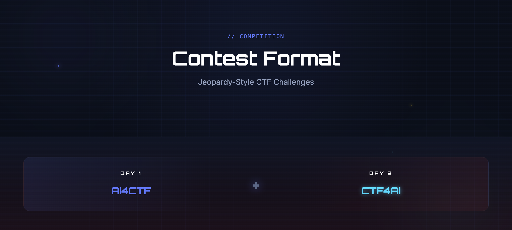

These are my solutions to the 2026 [ICOA Practice Challenges](https://practice.icoa2026.au/challenges). I still have a long way to go write the solutions, where the written ones will be highlighted in green color. Any questions or suggestions and be disscused in the [Discussion Page](https://github.com/Derderderr/ICOA-2026-write-ups/discussions). 

## Write-Ups

## *Crypto*

| Task | Points |
|:---- |:------ |
|  [RSA101](Solutions/Crypto/RSA101) | 178 |
| [Multi-layer](Solutions/Crypto/Multi-layer) | 340 |
| [Incorrect Implementation of RSA](Solutions/Crypto/Incorrect-Implementation-of-RSA) | 372 |
| [Mysteries of the Tomb](Solutions/Crypto/Mysteries-of-the-Tomb) | 384 |
| [Wise Words](Solutions/Crypto/Wise-Words) | 428 |
| [Sheet Music Cipher](Solutions/Crypto/Sheet-Music-Cipher) | 444 |
| [That's Not My Unicode](Solutions/Crypto/That's-Not-My-Unicode) | 460 |
| [The Perfect Breakfast](Solutions/Crypto/The-Perfect-Breakfast) | 472 |
| [#InMyLibraryClashingEra](Solutions/Crypto/#InMyLibraryClashingEra) | 484 |

## *Steg*

| Task | Points |
|:---- |:------ |
| [Cheese](Solutions/Steg/Cheese) | 192 |
| [Dogs Always Know](Solutions/Steg/Dogs-Always-Know) | 408 |
| [Looking through the sound](Solutions/Steg/Looking-through-the-sound) | 412 |
| [In the words of Taylor](Solutions/Steg/In-the-words-of-Taylor) | 436 |
| [TLSB](Solutions/Steg/TLSB) | 444 |
| [Nothing to See Here](Solutions/Steg/Nothing-to-See-Here) | 456 |
| [In the fine print](Solutions/Steg/In-the-fine-print) | 476 |
| [Stuck in Your Head](Solutions/Steg/Stuck-in-Your-Head) | 480 |
| [Layer Cake](Solutions/Steg/Layer-Cake) | 496 |

## *Misc*

| Task | Points |
|:---- |:------ |
| [Rules](Solutions/Misc/Rules) | 224 |
| [Survey](Solutions/Misc/Survey) | 236 |
| [The Job Interview](Solutions/Misc/The-Job-Interview) | 464 |
| [Old is gold](Solutions/Misc/Old-is-gold) | 488 |
| [Electric Debugger](Solutions/Misc/Electric-Debugger) | 496 |
| [Perceptions](Solutions/Misc/Perceptions) | 500 |

## *Forensics*

| Task | Points |
|:---- |:------ |
| [HexedHeaders](Solutions/Forensics/HexedHeaders) | 416 |
| [Keylogger](Solutions/Forensics/Keylogger) | 436 |
| [Ping](Solutions/Forensics/Ping) | 436 |
| [obfuscated script](Solutions/Forensics/obfuscated-script) | 456 |
| [There is always a trace](Solutions/Forensics/There-is-always-a-trace) | 468 |
| [Sound Inversion](Solutions/Forensics/Sound-Inversion) | 472 |

## *Rev*

| Task | Points |
|:---- |:------ |
| [Too Many Flags](Solutions/Rev/Too-Many-Flags) | 432 |
| [Xanarto](Solutions/Rev/Xanarto) | 480 |
| [cafe1995](Solutions/Rev/cafe1995) | 492 |
| [Doors 3](Solutions/Rev/Doors-3) | 496 |
| [Doors 2](Solutions/Rev/Doors-2) | 496 |
| [Doors](Solutions/Rev/Doors) | 496 |

## *OSINT*

| Task | Points |
|:---- |:------ |
| [Go git the door](Solutions/OSINT/Go-git-the-door) | 444 |
| [Class Above Par](Solutions/OSINT/Class-Above-Par) | 448 |
| [Online Presence](Solutions/OSINT/Online-Presence) | 460 |
| [Happy Birthday Corn Man!](Solutions/OSINT/Happy-Birthday-Corn-Man) | 468 |
| [Travelling Around](Solutions/OSINT/Travelling-Around) | 496 |
| [Ego is the weakness](Solutions/OSINT/Ego-is-the-weakness) | 496 |

## *Pwn*

| Task | Points |
|:---- |:------ |
| [Echo Chamber](Solutions/Pwn/Echo-Chamber) | 492 |
| [Flag Fish](Solutions/Pwn/Flag-Fish) | 500 |
| [fridge](Solutions/Pwn/fridge) | 500 |
| [Say Shells!](Solutions/Pwn/Say-Shells) | 500 |
| [Show Me What You GOT!](Solutions/Pwn/Show-Me-What-You-GOT) | 500 |

## Overview

> The 2026 Sydney International Cybersecurity Events have been officially upgraded to ICOA — the International Cyber Olympiad in AI — the World's First AI Security Olympiad. ICOA is a fully independent programme focused on AI security, with 30+ nations and regions accredited. Our dual-track format: Day 1 AI4CTF + Day 2 CTF4AI.

> Good luck. We hope you enjoy the challenge! 
